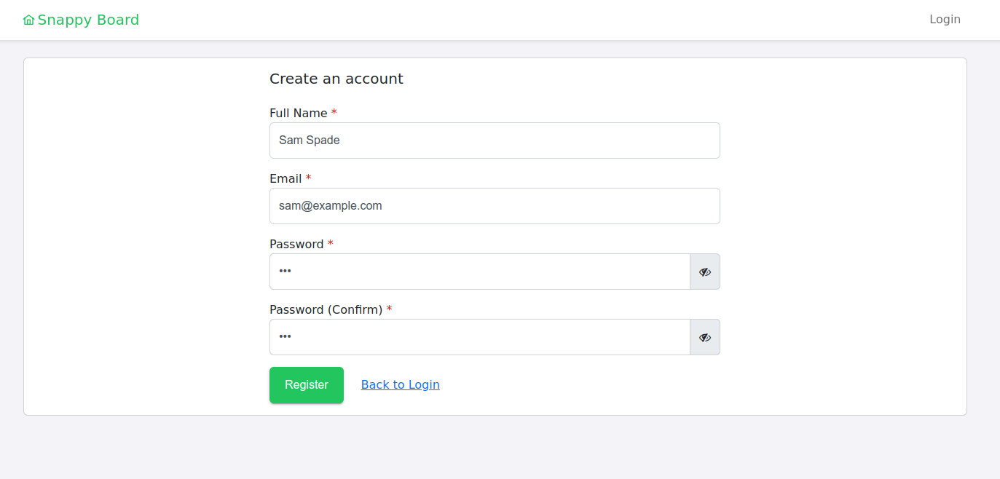
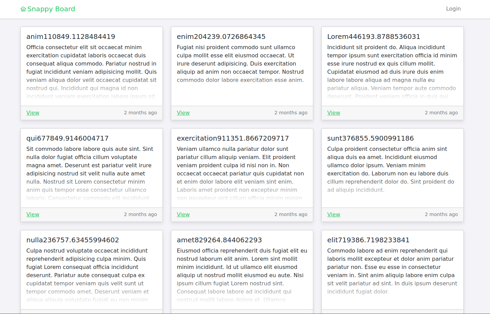
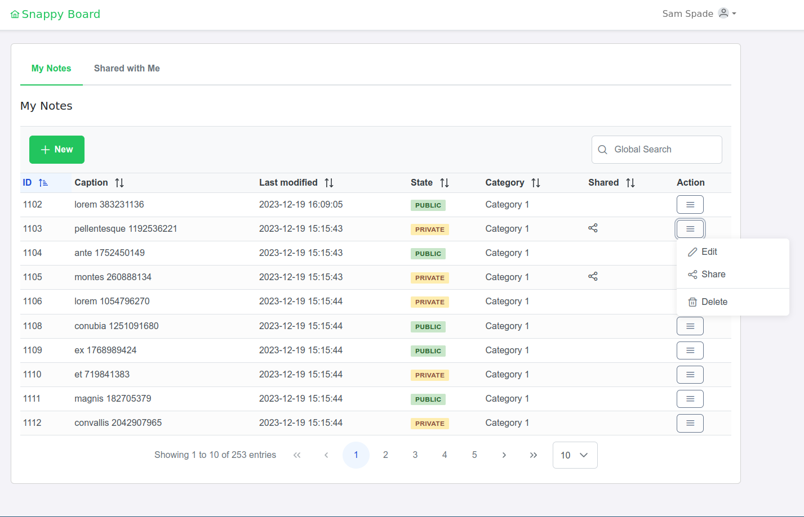
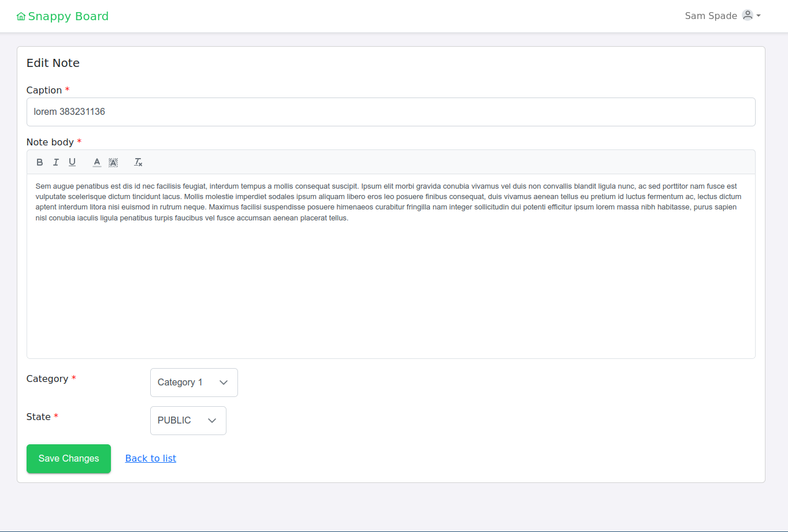
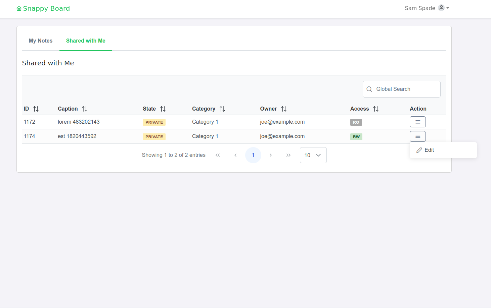
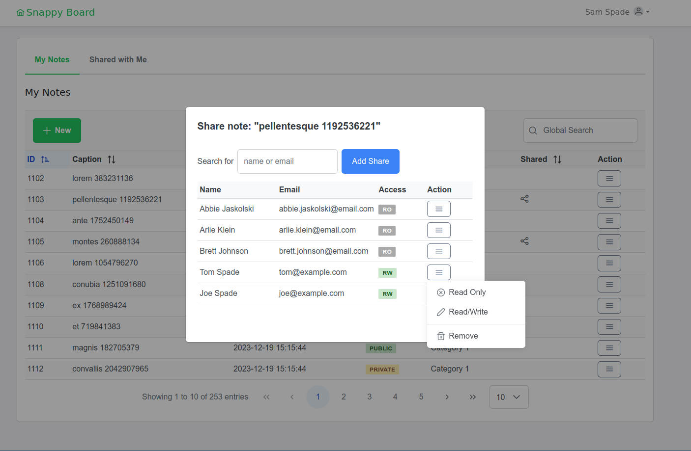
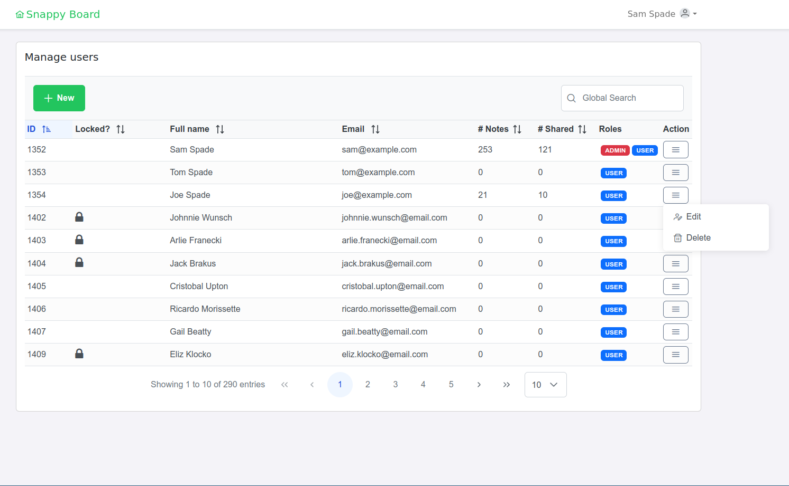

# Notivos

Demo application to manage a simple note board table with messages in different categories and with the ability to share private messages between the users (not visible for others). The applications use Java 17 + Spring Boot 3 and PostgreSQL for backend and Angular 15 for frontend.

## About the application

The initial deployment will create three demo user accounts

- `sam@example.com, password=123        ` The administrator account
- `joe@example.com, password=123        ` The user account
- `tom@example.com, password=123        ` The user account

The application implements user security using Spring Boot security, there are only two roles defined, ADMIN and USER. The user has to be logged in to manage their notes, the admin has the right to manage users and categories. The admin user can also manage their own notes, since the admin user is also a regular user of the application.

The new users can be registered by themselves or created by the user with ADMIN role.

Registration form



The main view



The users can manage their own notes

Managing notes



Or they can edit note if it was shared with RW access or view only if shared with RO access.

Note editing



"Shared with me" view



Manage shared notes


The user with ADMIN role can manage users

Manage users



# How to build

### Backend

The project uses GNU make for building the application components and also for deploying.
To build the backend, go to "sources/backend/java" and execute

```
$ make
```

To run the application from the console

```
$ make run
```

To create packaged version (JAR) execute. You have to do this for the deployment.

```
$ make package
```

### Frontend

The project uses GNU make for building the application components and also for deploying.

To build the backend, go to "sources/frontend" and execute. This has to be done before deployment.

```
$ make build
```

To run the dev server (http://localhost:4200)
```
$ make run
```

## Docker deployment

The project also contains all required scripts and configs for easy docker deployment. You can find all the necessary things in the docker folder.

To start a docker contains execute

```
$ make start-stack
```

To stop the containes

```
$ make stop-stack
```

The docker deployment includes nginx as a reverse proxy and to serve the Angular app. All configurations are stored in the config folder.

---

- UI Widgets
    https://primeng.org/

